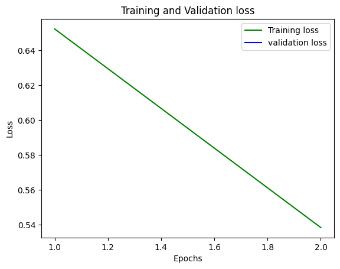
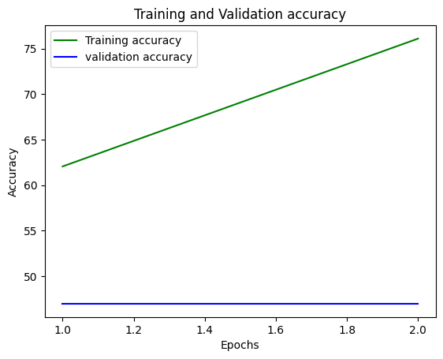
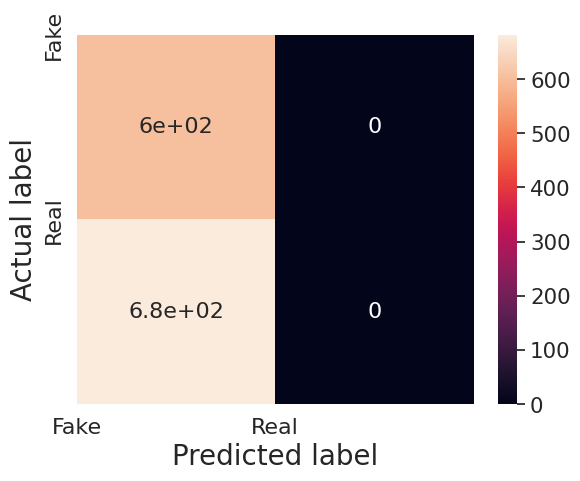

# DeepFake Detection System

## Overview

Advancements in computational power have significantly empowered deep learning algorithms, enabling the creation of hyper-realistic synthetic videos known as deep fakes. These sophisticated face-swapped deep fakes pose serious threats, such as political manipulation, fabricated terrorism incidents, revenge pornography, and extortion. In response, we propose a novel deep learning-based solution capable of distinguishing AI-generated fake videos from authentic ones. Our method focuses on automatically detecting both replacement and reenactment deep fakes.

Leveraging a Res-Next Convolutional Neural Network (CNN), we extract frame-level features, which are then utilized to train a Long Short-Term Memory (LSTM) based Recurrent Neural Network (RNN). This architecture effectively classifies videos, discerning whether they have undergone manipulation or remain genuine.

## Table of Contents

1. [Introduction](#introduction)
2. [Installation](#installation)
3. [Dataset](#dataset)
4. [Usage](#usage)
5. [Model Training](#training)
6. [Model Testing](#testing)

## Introduction

Deepfakes pose significant threats, such as political manipulation, fabricated terrorism incidents, revenge pornography, and extortion. Our proposed system utilizes a deep learning-based approach to detect both replacement and reenactment deep fakes. By combining Res-Next CNN for feature extraction and LSTM-based RNN for temporal analysis, we achieve high accuracy in classifying videos as real or fake.

## Convolutional Neural Network (CNN)

### What is a CNN?

A Convolutional Neural Network (CNN) is a type of deep learning architecture specifically designed for image and visual data processing tasks. CNNs are highly effective in tasks such as image classification, object detection, segmentation, and more. They are inspired by the visual processing mechanism in the human brain and have shown remarkable success in various computer vision applications.

### CNN Architecture

A typical CNN architecture consists of several layers that work together to learn and extract features from images. The primary layers in a CNN include:  </img>
#### 1. Convolutional Layers

Convolutional layers are the core building blocks of a CNN. These layers apply convolution operations to the input image using learnable filters (also known as kernels). The convolution operation involves sliding the filters over the input image, computing element-wise multiplications, and summing the results to produce feature maps. These feature maps capture different patterns, textures, and structures present in the input image.

#### 2. Activation Functions

After each convolutional layer, an activation function is applied element-wise to the feature maps. The most commonly used activation function is the Rectified Linear Unit (ReLU), which introduces non-linearity into the network and allows it to learn more complex features.

#### 3. Pooling Layers

Pooling layers are used to reduce the spatial dimensions of the feature maps while retaining the most important information. Max-pooling is a widely used pooling technique, which selects the maximum value from a small region of the feature map and discards the rest. Pooling helps in reducing the computational complexity and controlling overfitting.

#### 4. Fully Connected Layers

After several convolutional and pooling layers, the feature maps are flattened and passed through one or more fully connected layers. These layers serve as classifiers and are typically used for tasks like image classification, where the network needs to assign a label to the input image.

#### 5. Output Layer

The output layer of the CNN generates the final predictions based on the task. For example, in image classification, the output layer may have neurons representing different classes, and the class with the highest activation indicates the predicted label.
## Res-Next Convolution Neural Network

The Res-Next Convolutional Neural Network (CNN) is a variant of the ResNet (Residual Network) architecture, specifically designed for image feature extraction tasks. Here are key subtopics related to Res-Next:

### What is ResNet?

ResNet, short for Residual Network, introduced residual connections to address the vanishing gradient problem in deep neural networks. These connections allow gradients to flow more directly through the network during training, enabling the training of very deep networks (hundreds of layers) without degradation in performance.

### Enhancements in Res-Next

Res-Next further enhances the ResNet architecture by introducing a cardinality parameter, which controls the number of independent paths in each residual block. This enhancement increases the model's capacity to capture diverse features by promoting feature diversity and reducing information bottlenecks.  </img>

### Feature Extraction Capabilities

Res-Next CNNs excel in automatically learning hierarchical representations from input video frames. By leveraging deep layers and residual connections, they can capture intricate patterns, textures, and structures present in visual data.

### Efficiency and Scalability

Due to their parallelizable architecture and reduced computational cost compared to traditional CNNs, Res-Next models are efficient for processing large-scale datasets. This efficiency makes them well-suited for real-time applications such as deepfake detection.


## Recurrent Neural Network (RNN)

Recurrent Neural Networks (RNNs), including Long Short-Term Memory (LSTM) networks, are fundamental to capturing temporal dependencies in sequential data. Here are key subtopics related to RNNs:

### What is an RNN?

A Recurrent Neural Network (RNN) is a type of neural network designed for sequential data processing. RNNs are particularly effective for tasks involving temporal dependencies, such as video analysis, where the order of frames is important. LSTM networks, a type of RNN, are used to handle long-term dependencies and are effective in learning patterns over extended sequences.

### RNN Architecture

RNNs process sequences by maintaining a hidden state that captures information about previous elements in the sequence. This hidden state is updated at each time step, allowing the network to learn temporal dependencies and contextual information"


### Long Short-Term Memory (LSTM)

LSTM is a specific type of RNN architecture designed to overcome the limitations of traditional RNNs in learning long-term dependencies. Key features include memory cells that retain information over extended sequences and gate mechanisms (input, forget, and output gates) that control the flow of information through the network.


### Applications in Video Analysis

In the context of deepfake detection, RNNs (including LSTMs) are crucial for modeling temporal dynamics across video frames. They can detect anomalies, unnatural transitions, and inconsistencies that may indicate the presence of deepfake alterations.

### Sequence Processing Capabilities

RNNs excel in processing sequences of variable length, making them suitable for tasks where understanding the order and timing of data elements is essential. This capability allows them to effectively analyze and interpret sequential data such as video frames.

These deep learning architectures, including Res-Next CNN, RNN, and LSTM, play pivotal roles in our deepfake detection system by extracting features, capturing temporal dependencies, and distinguishing between authentic and AI-generated fake videos.

## Installation

To use this project, you need to set up a Python environment and install the required dependencies. Here's how you can do it:

1. Clone the repository:

    ```bash
    git clone https://github.com/Prajagar/Deep_Fake_Detection.git
    cd deepfake-detection-system
    ```

2. Install Dependencies:

    ```bash
    pip install -r requirements.txt
    ```

## Dataset

After preprocessing the DFDC dataset, we have taken:

- 1500 Real and 1500 Fake videos from the DFDC dataset.
- 1000 Real and 1000 Fake videos from the FaceForensic++ (FF) dataset.
- 500 Real and 500 Fake videos from the Celeb-DF dataset.

This results in a total dataset of 3000 Real and 3000 Fake videos, providing a comprehensive set of examples for training and evaluation.

## Usage

Before running any scripts, make sure you have prepared your dataset as described in the [Dataset](#dataset) section.

## Training

To train the CNN-RNN model on your dataset, you need to execute the training script: <a href="./Back End/Model.ipynb">`Model.ipynb`</a>

You can customize the training parameters, such as batch size, learning rate, and number of epochs, in the configuration file.

## Testing

To test the trained model, run the evaluation script: <a href="./Back End/Predict.ipynb">`Predict.ipynb`</a>

Make sure to replace `path_to_model` and `path_to_data` with the actual paths to your model and dataset.
Trained model [Download Deepfake Model](https://drive.google.com/file/d/1Bce5WJzmvt15V5hEmAqyNNQL3MIi7Sh5/view?usp=sharing)

## Front End

To run the webpage: <a href="./Front End/app.py">`app.py`</a>

Make sure to replace `path_to_model` and `path_to_data` with the actual paths to your model and dataset in <a href="./Front End/model.py">`model.py`</a>.

## Graph of Accuracy and loss

  


---

We believe this project will contribute significantly to the efforts to combat the spread of misinformation and safeguard the integrity of multimedia content in the digital age. Thank you for your interest and contributions!
